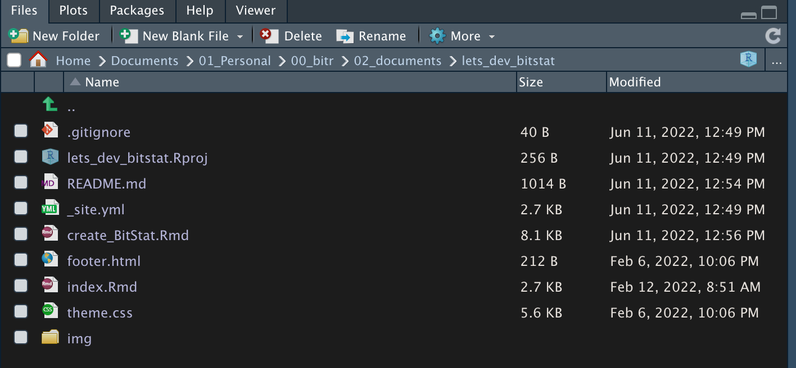

```{r setup, include=FALSE}
knitr::opts_chunk$set(echo = TRUE, 
                      message = FALSE, 
                      warning = FALSE, 
                      collapse = FALSE,
                      fig.align = "center")

library(shiny)
library(htmltools)
```

```{r news-app, echo=FALSE, out.width = "30%"}
knitr::include_graphics("img/rhino.png")
```

```{r, preface, echo=FALSE}
div(class = "preface", 
    h3("들어가기"),
    "간단한 예제의 Shiny 애플리케이션 문제가 없지만, 제법 복잡한 기능을 구현하는 Shiny 애플리케이션은 개발과 유지보수가 쉽지 않습니다.", br(),
    "BitStat를 협업으로 개발하려 하는 프로그램 코드와 프로젝트 구조의 복잡성으로 인해 어려움이 발생하였니다.",  br(),
    "그래서 Shiny 애플리케이션 개발 프레임워크인 Rhino 패키지로 재구성하여 합니다.",
    style = "margin-bottom: 40px;")
```

# BitStat 애플리케이션 구조 설계

## BitStat 패키지 생성

Rhino 패키지로 BitStat 패키지를 생성합니다.
다음과 같은 스크립트를 실행합니다.:

```
rhino::init("BitStat")
```

그러면 다음과 같은 진행 메시지가 출력되면서 프로젝트가 생성됩니다.

```{r, eval=FALSE}
> rhino::init("BitStat")
✔ Rproj file created.
* Initializing project ...
* Discovering package dependencies ... Done!
* Copying packages into the cache ... [80/80] Done!
The following package(s) will be updated in the lockfile:

# CRAN ===============================
- R.cache        [* -> 0.15.0]
- R.methodsS3    [* -> 1.8.1]
- R.oo           [* -> 1.24.0]
- R.utils        [* -> 2.11.0]
- R6             [* -> 2.5.1]
- Rcpp           [* -> 1.0.8.3]
- askpass        [* -> 1.1]
- backports      [* -> 1.4.1]
- base64enc      [* -> 0.1-3]
- box            [* -> 1.1.2]
- brio           [* -> 1.1.3]
- bslib          [* -> 0.3.1]
- cachem         [* -> 1.0.6]
- callr          [* -> 3.7.0]
- cli            [* -> 3.3.0]
- codetools      [* -> 0.2-18]
- commonmark     [* -> 1.8.0]
- config         [* -> 0.3.1]
- crayon         [* -> 1.5.1]
- curl           [* -> 4.3.2]
- cyclocomp      [* -> 1.1.0]
- desc           [* -> 1.4.1]
- diffobj        [* -> 0.3.5]
- digest         [* -> 0.6.29]
- ellipsis       [* -> 0.3.2]
- evaluate       [* -> 0.15]
- fansi          [* -> 1.0.3]
- fastmap        [* -> 1.1.0]
- fontawesome    [* -> 0.2.2]
- fs             [* -> 1.5.2]
- glue           [* -> 1.6.2]
- highr          [* -> 0.9]
- htmltools      [* -> 0.5.2]
- httpuv         [* -> 1.6.5]
- httr           [* -> 1.4.2]
- jquerylib      [* -> 0.1.4]
- jsonlite       [* -> 1.8.0]
- knitr          [* -> 1.37]
- later          [* -> 1.3.0]
- lazyeval       [* -> 0.2.2]
- lifecycle      [* -> 1.0.1]
- lintr          [* -> 2.0.1]
- logger         [* -> 0.2.2]
- magrittr       [* -> 2.0.3]
- mime           [* -> 0.12]
- openssl        [* -> 2.0.0]
- pillar         [* -> 1.7.0]
- pkgconfig      [* -> 2.0.3]
- pkgload        [* -> 1.2.4]
- praise         [* -> 1.0.0]
- processx       [* -> 3.5.3]
- promises       [* -> 1.2.0.1]
- ps             [* -> 1.7.0]
- purrr          [* -> 0.3.4]
- rappdirs       [* -> 0.3.3]
- rematch2       [* -> 2.1.2]
- remotes        [* -> 2.4.2]
- renv           [* -> 0.15.3]
- rex            [* -> 1.2.1]
- rhino          [* -> 1.0.0]
- rlang          [* -> 1.0.2]
- rprojroot      [* -> 2.0.3]
- rstudioapi     [* -> 0.13]
- sass           [* -> 0.4.1]
- shiny          [* -> 1.7.1]
- sourcetools    [* -> 0.1.7]
- stringi        [* -> 1.7.6]
- stringr        [* -> 1.4.0]
- styler         [* -> 1.6.2]
- sys            [* -> 3.4]
- testthat       [* -> 3.1.4]
- tibble         [* -> 3.1.7]
- utf8           [* -> 1.2.2]
- vctrs          [* -> 0.4.1]
- waldo          [* -> 0.4.0]
- withr          [* -> 2.5.0]
- xfun           [* -> 0.30]
- xml2           [* -> 1.3.3]
- xmlparsedata   [* -> 1.0.5]
- xtable         [* -> 1.8-4]
- yaml           [* -> 2.3.5]

* Lockfile written to '~/Documents/01_Personal/00_bitr/01_packages/BitStat_reorg/BitStat/renv.lock'.
The following folder(s) appear to be left-over temporary directories:

	file705e27d41a09

Consider removing these folders from your library.

✔ Initialized renv.
✔ Application structure created.
✔ Unit tests structure created.
✔ E2E tests structure created.
✔ Github Actions CI added.
```


## 프로젝트 구조

생성된 프로젝트의 폴더 구조는 다음과 같습니다.



그리고 이 폴더의 구조를 트리 모양으로 살펴보면 다음과 같습니다.

{width=80%}

